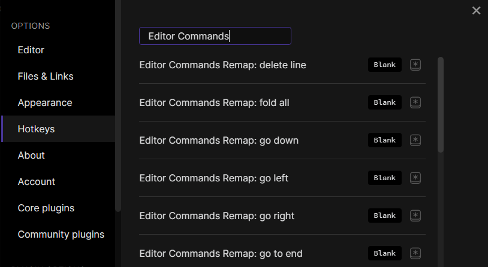

# Editor Commands Remap : Obsidian Plugin

This plugin for [Obsidian](https://obsidian.md) let's you map hotkeys to editor commands available in the API.
Available commands are :
- `goUp` : move cursor up a line
- `goDown` : move cursor down a line
- `goLeft` : move cursor left
- `goRight` : move cursor right
- `goStart` : move cursor to the start of the note
- `goEnd` : move cursor at the end of the note
- `indentMore` : indent current or selected lines
- `indentLess` : unindent current or selected lines
- `newlineAndIndent` : create a new line and indent cursor
- `swapLineUp` : swap the current line and the line above it
- `swapLineDown` : swap the current line and the line below it
- `deleteLine` : delete the current line
- `toggleFold` : fold or unfold item at current position
- `foldAll` : fold everything
- `unfoldAll` : unfold everyting

Note : these commands are only available when an editor is opened.
Note : some commands are already available in Obsidian, but for the sake of completeness, I still added them here.

The original idea was to replicate the behaviour of the [Tabout extension for VSCode](https://github.com/albertromkes/tabout) by [Albert Romkes](https://github.com/albertromkes), but mapping `Tab` as a hotkey is not possible in Obsidian. 
While studying the Obsidian API, I discovered the editor commands and thought it would be a good idea to be able to assign hotkeys to them.
Thus, to *kinda* replicate the Tabout behaviour, just set an hotkey to the 'goRight' command.

# Manual installation
You can manually install this plugin by downloading the latest release, and copy the file `manifest.json` and `main.js` under the folder `vaultFolder/.obsidian/plugins/editor-commands-remap`.

# How to use ?
This plugin does not set default hotkeys.
To set hotkeys, go to `Settings > Hotkeys` and search for `Editor Commands Remap`.

## Hotkeys recommendations
When moving the cursor, pressing `Shift` or `Ctrl+Shift` also select text. Thus, it is not recommended to use `Ctrl` or `Shift` as hotkey modifiers for moving the cursor.
`Alt` is the recommended modifier.